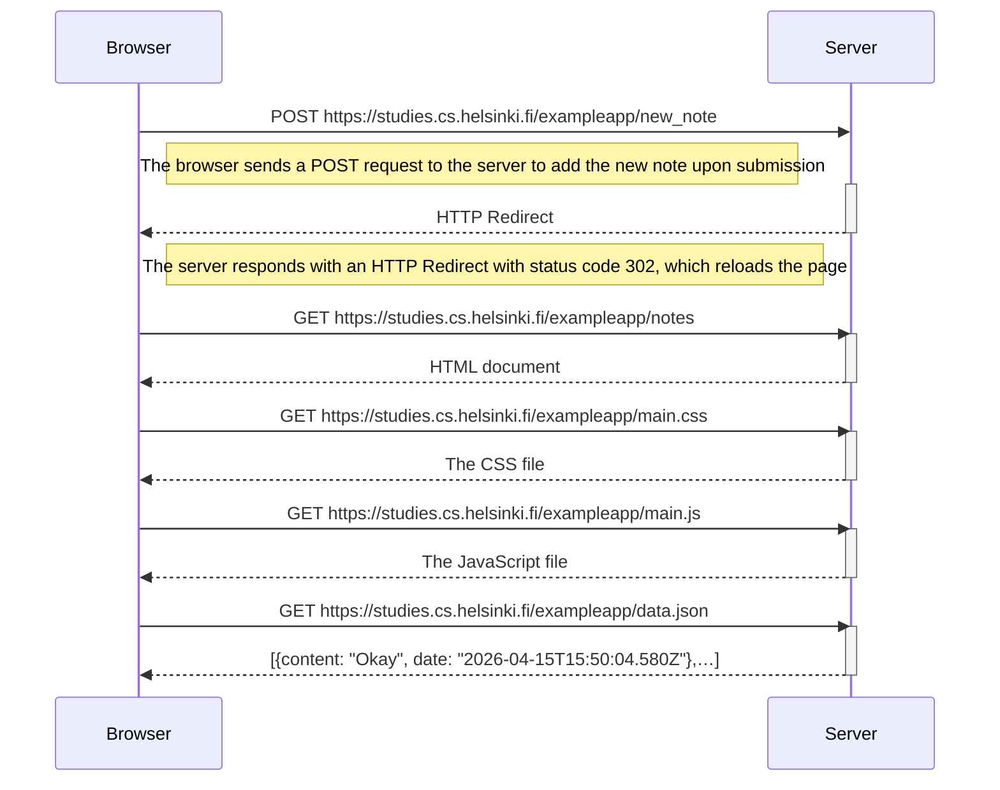

```mermaid
sequenceDiagram
    participant Browser
    participant Server

    Browser->>Server: POST https://studies.cs.helsinki.fi/exampleapp/new_note
    Note right of Browser: The browser sends a POST request to the server to add the new note upon submission
    activate Server
    Server-->>Browser: HTTP Redirect
    deactivate Server
    Note right of Browser: The server responds with an HTTP Redirect with status code 302, which reloads the page

    Browser->>Server: GET https://studies.cs.helsinki.fi/exampleapp/notes
    activate Server
    Server-->>Browser: HTML document
    deactivate Server

    Browser->>Server: GET https://studies.cs.helsinki.fi/exampleapp/main.css
    activate Server
    Server-->>Browser: The CSS file
    deactivate Server

    Browser->>Server: GET https://studies.cs.helsinki.fi/exampleapp/main.js
    activate Server
    Server-->>Browser: The JavaScript file
    deactivate Server

    Browser->>Server: GET https://studies.cs.helsinki.fi/exampleapp/data.json
    activate Server
    Server-->>Browser: [{content: "Okay", date: "2026-04-15T15:50:04.580Z"},…]
    deactivate Server

```
