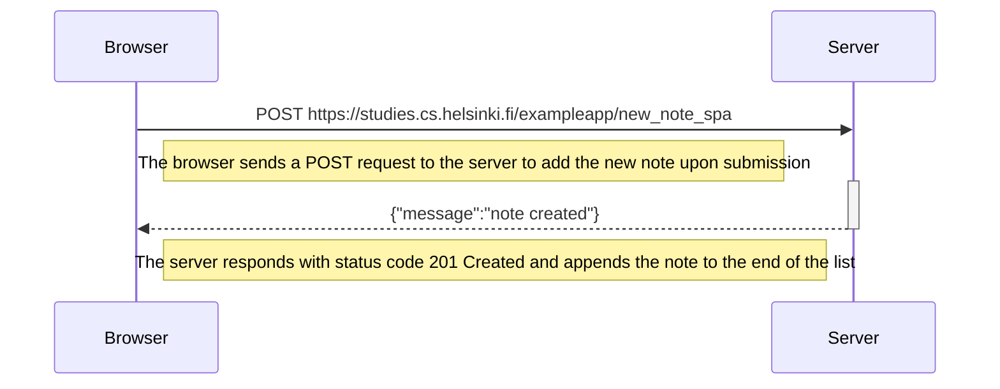

```mermaid
sequenceDiagram
    participant Browser
    participant Server

    Browser->>Server: POST https://studies.cs.helsinki.fi/exampleapp/new_note_spa
    Note right of Browser: The browser sends a POST request to the server to add the new note upon submission
    activate Server
    Server-->>Browser: {"message":"note created"}
    deactivate Server
    Note right of Browser: The server responds with status code 201 Created and appends the note to the end of the list
```
